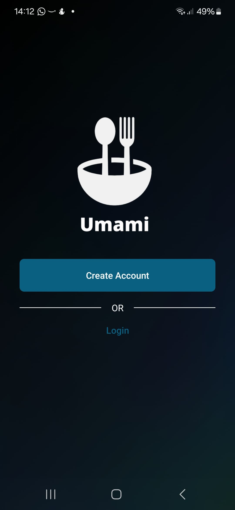

# Umami — Food-Focused Social Discovery App

Share your food experiences with friends and followers — and discover theirs. See your friends' recently tried spots, favourite places, and must-visit food joints.
Create and collaborate on curated food lists you can share with others.

**WIP! Stay hungry.** 🍕

<p align="center">
  
  &nbsp;&nbsp;&nbsp;
  
</p>

## **Another social media app?**

Touché... but the goal of Umami isn't to introduce yet another hub for doomscrolling. The ingenuity of social discovery apps lies in their ability to convert screen time into enriching real-life experiences. We're more invested in the opinions and experiences of people we know than those of anonymous internet strangers — which is why we have LetterBoxd for movies, Goodreads for books, Backloggd for video games... but nothing for restaurants, yet. For foodies, that's a gap worth filling.

## Tech Stack

**Frontend**

- TypeScript
- Expo + React Native

**Backend**

- TypeScript
- Node.js + Express (REST API)
- Zod (validation)
- JWT (auth)

**Database**

- MongoDB
- Mongoose (ODM)

**Media & Hosting**

- Cloudinary (media hosting)

**Tooling**

- Docker (database container + seeding)
- PNPM (monorepo/workspaces)

## **Getting Started**

To try Umami for yourself, you'll need:

- Node.js ≥ 18.17.0 with Corepack enabled
- Docker
- A Cloudinary product environment you can write to and read from
- Expo Go mobile app

### **Setting up the application**

From the root folder:

1. Install all dependencies across the root, `client` and `api` workspaces:

   ```bash
   pnpm install
   ```

2. Start Docker, then initialise and seed the database with mock data:

   ```bash
   pnpm run init-db
   ```

3. Create a .env file in the `api` workspace and add the following environment variables:
   ```env
   NODE_ENV=development
   DB_URI=mongodb://localhost:27017
   DB_NAME=dev
   JWT_SECRET=<your-jwt-secret>
   CLOUDINARY_CLOUD_NAME=<your-cloudinary-cloud-name>
   CLOUDINARY_API_KEY=<your-cloudinary-api-key>
   CLOUDINARY_API_SECRET=<your-cloudinary-api-secret>
   ```
   `JWT_SECRET` can be any string that satisfies the schema defined in [`envSchema`](api/src/validations.ts). Cloudinary credentials must be obtained from your Cloudinary dashboard.
4. Start the API server:

   ```bash
   pnpm run start-api
   ```

5. Create a .env file in the `client` workspace and add the following environment variables:

   ```env
   EXPO_PUBLIC_BASE_URL="<machine-ip-address>:<server-port>"
   EXPO_PUBLIC_CLOUDINARY_CLOUD_NAME=<your-cloudinary-cloud-name>
   EXPO_PUBLIC_CLOUDINARY_API_KEY=<your-cloudinary-api-key>
   ```

   Use the private IP address of the machine running the API to allow other devices (like your phone running Expo Go) to connect to the server without needing a tunnel. You can find your private IP address by running:

   - macOS / Linux: ifconfig or ip a
   - Windows: ipconfig

6. Start the Expo client:

   ```bash
   pnpm run start-client
   ```

   If the Expo Go app runs into issues loading the project, make sure your firewall allows inbound connections to Node.js apps. If that doesn't resolve things, try running the client using a tunnel to bypass firewall restrictions:

   ```bash
   pnpm run start-client-tunnel
   ```

7. You're good to go!

### **Note: Usage of PNPM with Expo**

Unfortunately, Expo / React native currently don't play well with pnpm's use of symlinks and isolated `node_modules` — see [this Expo issue](https://github.com/expo/expo/issues/22413) and [this pnpm discussion](https://github.com/pnpm/pnpm/issues/4286#issuecomment-2483856710). To work around this, dependencies currently need to be hoisted (via `node-linker=hoisted` in `.npmrc`) or [tinker manually with the Metro bundler's config](https://gist.github.com/Zn4rK/ed60c380e7b672e3089074f51792a2b8). Hoisting of course undermines the main point of using pnpm in the first place — fortunately though, Expo is working on addressing this problem so projects can use pnpm with its efficiency and speed benefits intact. See [here](https://github.com/byCedric/expo-monorepo-example?tab=readme-ov-file#pnpm-workarounds) for more information.
